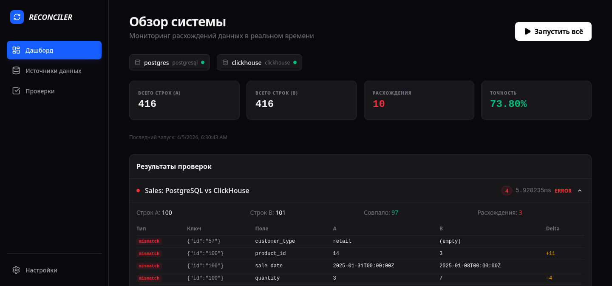
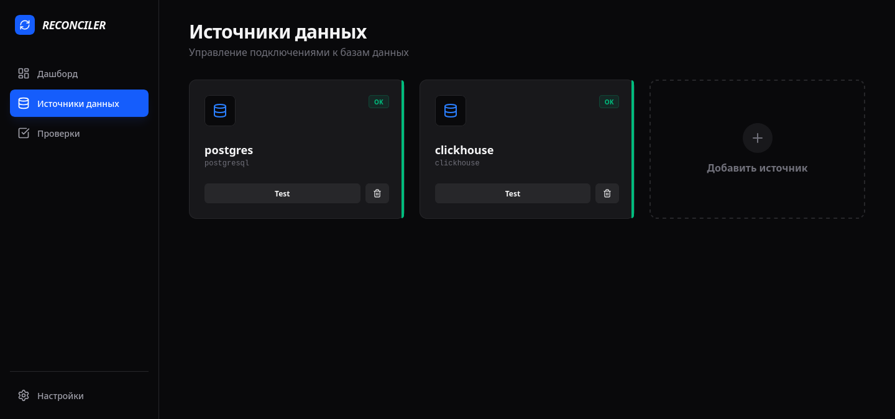
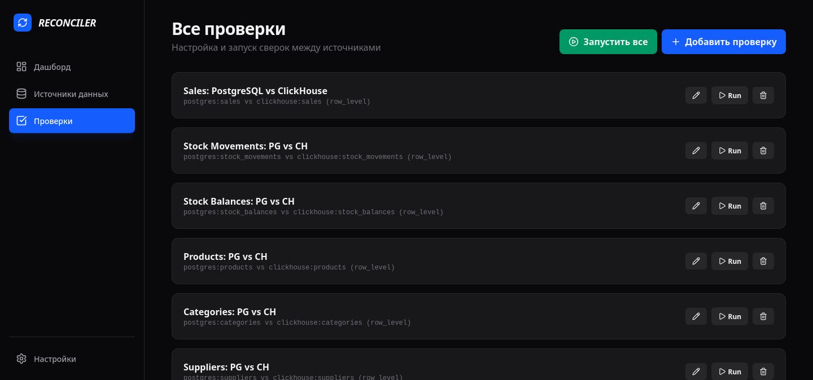
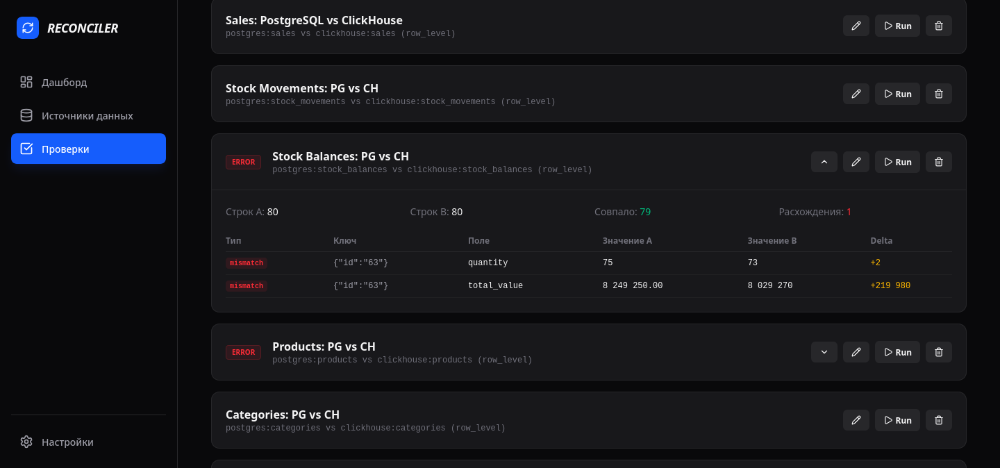

# Data Reconciler

Инструмент сверки данных между произвольными источниками. Подключил два датасорса, настроил маппинг, получил расхождения — без AI, чисто алгоритмически.









---

## Зачем

BI-аналитик работает с данными из разных систем: 1С, ClickHouse, PostgreSQL, Excel. Данные перетекают из одной системы в другую через ETL-пайплайны, и по дороге неизбежно ломаются: строки теряются, суммы расходятся, даты сдвигаются, дубликаты появляются из-за retry.

Сейчас аналитик ищет эти расхождения руками — пишет SQL-запросы к обоим источникам, сводит результаты в Excel, глазами ищет где не сходится. Это занимает 60-70% рабочего времени. Особенно больно в финансах, где допустимое расхождение — ноль. Один тенге дельты в 910 форме — это уже ошибка, по которой неправильно начисляют ИПН.

Data Reconciler автоматизирует именно эту часть: подключился к двум базам, сказал "таблица А здесь = таблица Б там, сверяй по такому ключу" — получил отчёт с точным списком расхождений. Не "примерно тут что-то не так", а "строка id=13, поле total_amount, в 1С 279980, в ClickHouse 289980, дельта -10000".

---

## Для кого

Основной пользователь — BI-аналитик, не разработчик. Он:

- Знает SQL, но не хочет писать сверочные запросы руками каждый раз
- Работает с 1С, ClickHouse, PostgreSQL, иногда Excel/CSV
- Не имеет доступа к ETL-пайплайнам (это делает "инженер"/разработчик)
- Хочет точно знать: "клик надёжный или нет" — то есть данные в аналитической БД соответствуют источнику истины
- Не готов ставить Python/Docker/CLI-утилиты — ему нужна одна кнопка

---

## Компоненты

Проект состоит из трёх независимых компонентов с отдельным версионированием:

| Компонент | Описание | Артефакт |
|-----------|----------|----------|
| **Backend** | Go HTTP-сервер, API, reconciler engine | `reconciler-{version}-{os}-{arch}` |
| **Frontend** | React SPA (Vite), работает в браузере | `frontend-{version}.tar.gz` |
| **Desktop** | Electron-обёртка, запускает backend + frontend | `.AppImage` / `.dmg` / `.exe` |

Версии указаны в файле `VERSION`:
```
backend=0.4.0
frontend=0.4.0
desktop=0.4.0
```

Совместимость между версиями описана в `compatibility.json`.

### Варианты использования

1. **Только backend** — скачать один бинарник, запустить, открыть `localhost:8080` в браузере. Фронтенд раздаётся через `-static` флаг или из `./web/dist`.
2. **Backend + Frontend** — раздельное развёртывание (backend на сервере, frontend через nginx).
3. **Desktop** — Electron-приложение, всё в одном. Backend стартует как child process.

---

## Окружение для сборки

Проект разрабатывается и тестируется на:

| Tool | Version |
|------|---------|
| OS | Arch Linux, kernel 6.19.10 |
| Go | 1.26.1 |
| Node.js | 24.13.0 |
| npm | 11.6.2 |
| Electron | 33.4.11 |
| electron-builder | 25.1.8 |
| Docker | 28.x |
| PostgreSQL | 16 (alpine) |
| ClickHouse | 24.3 |

---

## Типичные сценарии

**Склад и поставщики.** Три таблицы: факт движения, факт остатков, факт продаж. Балансовое правило: остаток вчера + приход - расход - продажи = остаток сегодня. Если не сходится — баг в ETL или в формуле аналитика.

**Финансовая отчётность.** 910 форма (доходы ИП/ТОО для начисления ИПН). Данные из 1С должны 1:1 совпадать с тем, что попало в аналитику. Порог допустимости расхождений — ноль.

**Маркетинг.** Лиды из CRM vs. данные в аналитике. Какие каналы просели, где потерялись записи при импорте.

**Закупки.** Сколько заказали у поставщика, сколько произведено, сколько отгружено на склад — сверка между системой поставщика и собственной учётной системой.

---

## Архитектура

```
┌─────────────────────────────────────────────────────┐
│                    React SPA (UI)                    │
│  Подключения → Маппинг → Проверки → Результаты     │
└─────────────────┬───────────────────────────────────┘
                  │ REST API
┌─────────────────▼───────────────────────────────────┐
│                 Go Backend                           │
│                                                      │
│  ┌──────────┐  ┌──────────────┐  ┌───────────────┐ │
│  │ HTTP API │  │ Reconciler   │  │  DataSource   │ │
│  │ (Chi)    │──│ Engine       │──│  Interface    │ │
│  └──────────┘  └──────────────┘  └───────┬───────┘ │
│                                          │         │
│                    ┌─────────────────────┼──────┐  │
│                    │   GenericSQL        │      │  │
│                    │   (database/sql)    │      │  │
│                    └─────────────────────┘      │  │
│                    │         │         │         │  │
│                 PG driver  CH driver  MySQL    ... │
└─────────────────────────────────────────────────────┘
```

### Драйверы

| БД | Драйвер | Порт |
|----|---------|------|
| PostgreSQL | `github.com/lib/pq` | 5432 |
| ClickHouse | `clickhouse-go/v2` | 9000 |
| MySQL/MariaDB | `go-sql-driver/mysql` | 3306 |
| SQLite | `mattn/go-sqlite3` | — |
| MSSQL | `microsoft/go-mssqldb` | 1433 |

Добавить новую базу = написать ~30 строк нового диалекта.

---

## Три режима сверки

### Count
Количество строк в таблице A = количество строк в таблице B.

### Aggregate
SUM/COUNT агрегатов. Быстро для больших таблиц.

### Row-level
Построчное сравнение по ключу. Находит потерянные строки, дубликаты, расхождения в значениях с точной дельтой.

---

## Тестовые данные

Docker Compose поднимает PostgreSQL (источник истины) и ClickHouse (аналитика после ETL). Данные — розничная торговля электроникой в Казахстане: 20 SKU, 5 поставщиков, ~90 продаж за январь 2025.

В ClickHouse заложено **8 типичных ETL-багов**:

| # | Тип | Что случилось |
|---|-----|---------------|
| 1 | Потеря строки | Приход Samsung TV 15шт потерян при ETL |
| 2 | Потеря строки | Приход кондиционеров 35шт потерян |
| 3 | Дубликат | Продажа ЧК-0010 записана дважды (retry) |
| 4 | Ошибка суммы | total_amount 279980 → 289980 |
| 5 | Сдвиг даты | Дата движения 2025-01-08 → 2025-01-06 |
| 6 | Кеш прайса | unit_price 89990 → 89900 (устаревший) |
| 7 | Ошибка расчёта | Остаток quantity 75 → 73 |
| 8 | Пустое поле | customer_type '' вместо 'retail' |

---

## Как запустить

```bash
# 1. Тестовые БД
make up

# 2. Frontend
make frontend

# 3. Backend (dev — фронтенд из ./web/dist)
make run

# 4. Открыть
open http://localhost:8080
```

### Desktop (Electron)

```bash
make desktop
```

### Сборка дистрибутива

```bash
make desktop-dist
```

---

## CI/CD

При пуше тега `v*` GitHub Actions собирает:

**Standalone (без Electron):**
- `reconciler-*-linux-amd64`
- `reconciler-*-darwin-amd64`
- `reconciler-*-darwin-arm64`
- `reconciler-*-windows-amd64.exe`
- `frontend-*.tar.gz`

**Desktop (Electron):**
- `.AppImage` + `.tar.gz` (Linux)
- `.dmg` (macOS x64 + arm64)
- `.exe` NSIS installer (Windows)

Electron-версия включает автообновление через GitHub Releases.

```bash
git tag v0.4.0
git push origin v0.4.0
```
